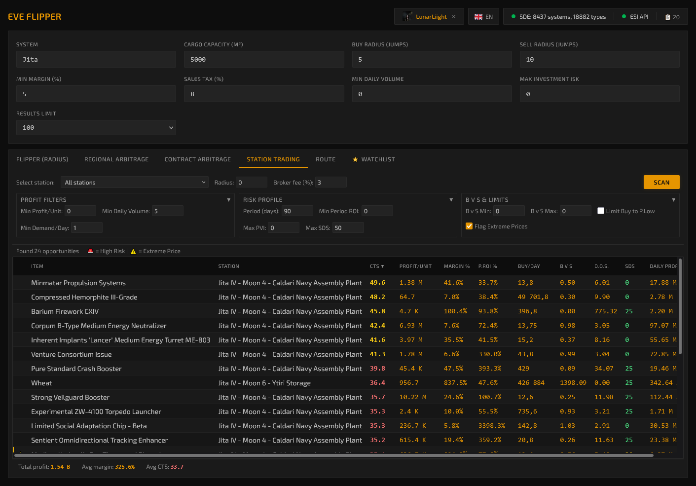
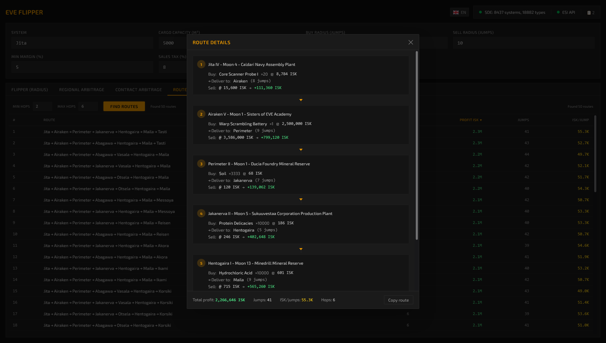
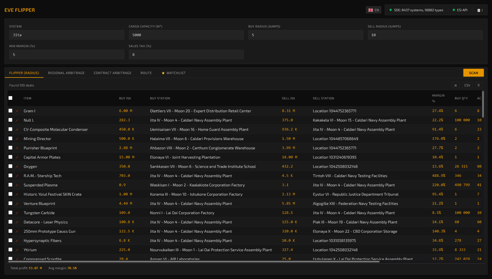

# EVE Flipper

EVE Flipper is a local-first market analysis platform for EVE Online traders.
It combines live ESI order books, historical market behavior, and execution-aware math to surface actionable opportunities across multiple trading workflows.

[](https://go.dev/)
[](https://react.dev/)
[](https://www.typescriptlang.org/)
[](LICENSE)
[](https://github.com/ilyaux/Eve-flipper/releases/latest)
[](https://github.com/ilyaux/Eve-flipper/releases)
[](https://github.com/ilyaux/Eve-flipper/commits/master)
[](https://discord.gg/rnR2bw6XXX)

## What It Includes

### Trading Tabs
- `Flipper (Radius)`: local buy/sell opportunities with execution-aware metrics.
- `Regional Trade`: cross-region day-trade scanner with target marketplace controls and grouped output.
- `Contract Arbitrage`: contract valuation and liquidation scenarios.
- `Route`: multi-hop route builder with ISK/jump constraints.
- `Station Trading`: same-station scanner with liquidity/risk filters.
- `Industry`: production planning and industry ledger workflows.
- `War Tracker`: demand/activity view for region-level opportunities.
- `PLEX+`: PLEX analytics and profitability dashboards.

### Core UX and Analysis Features
- `Execution-aware pricing`: expected fill price, slippage, fillability, and real profit fields.
- `System blacklist`: ignore selected systems globally in scan parameters.
- `Batch Builder`: build same-route cargo manifests from a selected deal.
- `Auto-refresh`: cache-aware refresh for Flipper and Regional tabs.
- `Player structures support`: optional structure inclusion (requires EVE login and access).
- `Watchlist + Scan History`: persist and revisit tracked items and previous scans.

### Local-First Runtime
- Single backend binary with embedded frontend.
- Default bind: `127.0.0.1:13370`.
- SQLite persistence for config, history, and local state.

## Screenshots

| Station Trading | Route Trading | Flipper (Radius) |
|---|---|---|
|  |  |  |

## Quick Start

### Option 1: Release binaries

Download the latest build:
- https://github.com/ilyaux/Eve-flipper/releases

Release asset naming:
- Classic binary: `eve-flipper-windows-amd64.exe` (and `linux/darwin` variants)
- Wails desktop binaries: `eve-flipper-wails-windows-amd64.exe`, `eve-flipper-wails-linux-amd64`, `eve-flipper-wails-linux-arm64`, `eve-flipper-wails-darwin-amd64`, `eve-flipper-wails-darwin-arm64`

Run the binary and open:
- `http://127.0.0.1:13370`

### Option 2: Build from source

Prerequisites:
- Go `1.25+`
- Node.js `20+`
- npm

```bash
git clone https://github.com/ilyaux/Eve-flipper.git
cd Eve-flipper
npm -C frontend install
npm -C frontend run build
go build -o build/eve-flipper .
./build/eve-flipper
```

Windows PowerShell helpers:

```powershell
.\make.ps1 build
.\make.ps1 run
```

Unix Make targets:

```bash
make build
make run
```

### Option 3: Wails desktop variant (separate mode)

This mode keeps the existing runtime modes untouched (`Go embedded web app` and `Tauri`),
and adds an additional desktop build powered by Wails.

PowerShell:

```powershell
.\make.ps1 wails
```

Output:
- `build/eve-flipper-wails.exe`

Manual build equivalent:

```bash
go build -tags wails,production -ldflags "-s -w -H=windowsgui -X main.version=dev" -o build/eve-flipper-wails.exe .
```

Run directly:

```powershell
.\make.ps1 wails-run
```

Unix Make:

```bash
make wails
make wails-run
```

## Runtime Flags

```bash
./eve-flipper --host 127.0.0.1 --port 13370
```

| Flag | Default | Description |
|------|---------|-------------|
| `--host` | `127.0.0.1` | Bind address (`0.0.0.0` for LAN/remote access) |
| `--port` | `13370` | HTTP port |

## EVE SSO (Optional)

Many scanners work without login, but these features require EVE SSO:
- Character-aware fees/skills autofill
- Character orders/assets-based workflows
- Player structure market data and structure names
- Corporation dashboards/endpoints

Create `.env` in repo root for local/source builds:

```env
ESI_CLIENT_ID=your-client-id
ESI_CLIENT_SECRET=your-client-secret
ESI_CALLBACK_URL=http://localhost:13370/api/auth/callback
```

Do not commit `.env`.

## Development Workflow

Backend:

```bash
go run .
```

Frontend dev server:

```bash
npm -C frontend install
npm -C frontend run dev
```

Tests:

```bash
go test ./...
```

Production frontend build check:

```bash
npm -C frontend run build
```

## Documentation

- Project wiki: https://github.com/ilyaux/Eve-flipper/wiki
- Getting Started: https://github.com/ilyaux/Eve-flipper/wiki/Getting-Started
- API Reference: https://github.com/ilyaux/Eve-flipper/wiki/API-Reference
- Station Trading: https://github.com/ilyaux/Eve-flipper/wiki/Station-Trading
- Contract Scanner: https://github.com/ilyaux/Eve-flipper/wiki/Contract-Scanner
- Execution Plan: https://github.com/ilyaux/Eve-flipper/wiki/Execution-Plan
- PLEX Dashboard: https://github.com/ilyaux/Eve-flipper/wiki/PLEX-Dashboard

## Security Notes

- By default, server listens only on localhost.
- ESI credentials are optional for non-SSO features.
- If exposed beyond localhost (`--host 0.0.0.0`), use your own network hardening (firewall/reverse proxy/TLS).

## Contributing

See:
- `CONTRIBUTING.md`

## License

MIT License. See `LICENSE`.

## Disclaimer

EVE Flipper is an independent third-party project and is not affiliated with CCP Games.
EVE Online and related trademarks are property of CCP hf.
